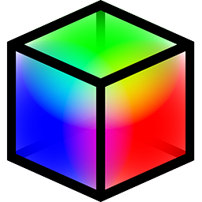

<p align="center">
  
</p>

# DesktopLUT

Apply display calibration to your entire Windows desktop in real-time.

## What is this?

DesktopLUT replaces Windows' limited color management with proper display correction. It's a transparent overlay that captures your desktop, applies color corrections (3D LUT, grayscale, primaries, tonemapping), and displays the result on top. You see corrected colors while your mouse, keyboard, and apps work normally underneath.

**No calibration hardware?** You can still use DesktopLUT without a colorimeter - enter your display's primaries from its spec sheet, adjust grayscale by eye, or just use the HDR gamma fix and tonemapping. Full calibration with a 3D LUT gives the best results, but isn't required.

## Features

- **Works without LUT files** - Use primaries correction, grayscale adjustment, and tonemapping standalone
- **Full 3D LUT support** - Load calibration LUTs from profiling software (.cube format)
- **HDR and SDR** - Automatic detection, separate settings for each mode
- **Fix washed-out HDR desktop** - Toggle converts SDR content from sRGB to proper 2.2 gamma (Win+Shift+G)
- **App whitelist** - Auto-disable HDR gamma correction when video players or video games run.
- **Multi-monitor** - Different LUTs and settings per display
- **Grayscale correction** - Fine-tune gamma/EOTF tracking with 10/20/32-point curves
- **Primaries correction** - Fix oversaturated colors on wide-gamut displays
- **Tonemapping** - Multiple algorithms for HDR content (BT.2390, Reinhard, etc.)
- **No input lag** - Adds ~1 frame of visual latency; input goes directly to apps
- **System tray** - Runs quietly in the background, auto-starts with Windows if configured

## Requirements

- Windows 10 (build 19041+) or Windows 11
- Any DirectX 11 GPU

## Getting Started

1. Download or build `DesktopLUT.exe`
2. Run it - the GUI opens
3. For each monitor, configure your corrections (see below)
4. Click **Enable** - the overlay activates
5. Minimize to system tray for 24/7 operation

### Quick Start (No Calibration Hardware)

If you just want to fix common issues without a colorimeter:

**Washed-out SDR content in HDR mode:**
1. Go to **Settings** tab, ensure the Gamma hotkey is enabled
2. Click **Enable**
3. Press **Win+Shift+G** to toggle - SDR content will look correct
4. Add video players and games to the whitelist so HDR mastered content is not affected

**Oversaturated colors on wide-gamut display:**
1. Go to **SDR Options** tab
2. Enable **Primaries Correction**
3. Click **Detect** or select a preset matching your display (P3-D65, Adobe RGB, etc.)
4. Click **Enable**

## Calibration Guide

For accurate calibration, you'll need a colorimeter or spectrophotometer and profiling software (DisplayCAL, ColourSpace, Calman, LightSpace, etc.).

### Understanding the Pipeline

DesktopLUT applies corrections in this order:

```
OS → Grayscale → Primaries → 3D LUT → Your Display
```

The key insight: **do the heavy lifting with Grayscale and Primaries first**, then use the 3D LUT to fix what's left. This keeps LUT corrections small and stable.

### (Optional)
Pre-calibrate with your monitor's OSD settings.

### Step 1: Enter Your Display's Native Primaries

Go to the **SDR Options** tab (or HDR Options for HDR calibration).

1. Enable **Primaries Correction**
2. Click **Detect** to read your monitor's EDID, or enter values from your display's spec sheet
3. This tells DesktopLUT how to map sRGB content to your display's actual color gamut

*Why this matters:* Wide-gamut displays show oversaturated colors because they interpret sRGB values using their wider primaries. This correction fixes that.

### Step 2: Adjust Grayscale (Gamma Tracking)

1. Enable **Grayscale Correction**
2. Choose 10, 20, or 32 control points
3. Display grayscale test patterns in your profiling software
4. Adjust sliders until your meter shows the target gamma (usually 2.2 for SDR)

Each slider corresponds to a specific brightness level. Slider N affects patch N in your profiling software.

*Tip:* For SDR, you can also enable **2.4 Gamma** if your workflow requires BT.1886 (broadcast standard).

### Step 3: Profile WITH Corrections Active

This is crucial: **run your profiling software while DesktopLUT is active** with your Primaries and Grayscale corrections enabled.

1. Make sure DesktopLUT is running with your corrections from Steps 1-2
2. Profile your display using your normal workflow
3. Generate a 3D LUT (33³ or 65³ recommended)
4. The LUT will only need to correct residual errors, not the entire response

### Step 4: Load the LUT

1. In the **LUT Options** tab, browse to your generated .cube file
2. If you calibrate HDR separately, load that LUT in the HDR field
3. Click **Enable**

### Step 5: Verify and Fine-Tune

Run verification patches through your profiling software:
- Target: ΔE < 1 for grayscale, ΔE < 2 for colors
- If needed, make small adjustments to Grayscale sliders
- Since the LUT corrections are hopefully small, minor tweaks won't drastically affect accuracy

### HDR Calibration Notes

- HDR uses the ICtCp color space (Dolby) for accurate luminance handling
- Set **Grayscale Peak** to match your profiling software's target peak (e.g., 1000 nits)
- HDR grayscale operates on the I (intensity) channel, preserving hue
- Tonemapping is optional - configure based on your content preferences

### What NOT to Do

- **Don't profile first, then add corrections** - This creates a LUT designed for uncorrected input, then feeds it corrected input. Double-correction ensues.
- **Don't make large post-LUT adjustments** - If you need big changes, regenerate the LUT with updated corrections.
- **Don't profile HDR with tonemapping enabled** - Easy to forget.

## Hotkeys

All hotkeys use **Win+Shift** and are configurable in Settings:

| Hotkey | Action |
|--------|--------|
| Win+Shift+G | Toggle gamma mode (sRGB ↔ 2.2 for SDR-in-HDR content) |
| Win+Shift+Z | Toggle HDR on/off for focused monitor |
| Win+Shift+X | Toggle analysis overlay (shows peak nits, gamut info, histogram) |

## Supported LUT Formats

- **.cube** - Industry standard (Adobe, Resolve, any size)
- **.txt** - eeColor format (65³ only)

## Limitations

- **~1 frame visual delay** - Inherent to capture-and-reprocess; input is unaffected
- **DRM content shows black** - Windows security prevents capturing protected content
- **Some system UI not captured** - Start menu animations, notification popups
- **NVIDIA G-Sync disabled while active** - The overlay window breaks VRR on NVIDIA GPUs ([details](https://github.com/sup3rflyer/DesktopLUT/issues/1)). AMD FreeSync and Intel VRR work normally.

## Building from Source

Requires Visual Studio 2022 with C++ desktop development workload.

```
MSBuild DesktopLUT.sln -p:Configuration=Release -p:Platform=x64
```

Or open `DesktopLUT.sln` in VS2022 and build Release x64.

## Technical Details

See [REFERENCE.md](REFERENCE.md) for in-depth technical documentation including:
- Complete color pipeline (ICtCp, PQ, matrix constants)
- INI file format and all settings
- Performance characteristics
- Implementation details

## License

GPL v3 - See [LICENSE](LICENSE)
