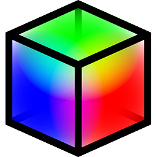

  

# DesktopLUT

DesktopLUT applies color corrections to the entire Windows desktop in real time using a three-layer system. It works with any DirectX 11 GPU and supports both SDR and HDR modes.

## How the three layers work

DesktopLUT uses the following layers, which can be enabled individually or together:

1. **MHC (GPU-level)**
   Installs color corrections directly at the graphics card driver level. This layer remains active even when DesktopLUT is not running.

2. **3D LUT**
   Applies a volumetric color correction using a loaded .cube file.

3. **Corrections**
   Provides real-time adjustments including white point shift, grayscale correction with per-point RGB tuning, and HDR tone mapping.

The layers are applied in sequence within a single shader pass.

## Requirements

- Windows 10 (version 21H2 or newer) or Windows 11
- DirectX 11 compatible GPU (NVIDIA, AMD, or Intel)
- Recommended: Enable "Auto Color Management" in Windows display settings

## Installation

1. Download the latest `DesktopLUT.exe` from the [Releases page](https://github.com/sup3rflyer/DesktopLUT/releases).
2. Run the executable (no installer is required).
3. The settings window will open automatically.

## Common setups

### 1. Correct SDR content in HDR mode
This addresses washed-out colors when using HDR.

1. Open DesktopLUT and go to the **Settings** tab.
2. Ensure the gamma hotkey is enabled.
3. Click **Start**.
4. Use the hotkey **Win + Shift + G** to toggle the correction.
5. Add video players and games to the gamma whitelist so the correction is bypassed for those applications.

### 2. Apply basic color correction using MHC
1. Go to the **I. MHC** tab.
2. Click **Detect** to read the monitor's reported color primaries (or enter values manually).
3. Click **Apply**.

This correction stays active at the GPU level.

### 3. Use a measured 3D LUT
1. Keep the MHC layer active (if used).
2. Generate a .cube file (33³ or 65³) with your calibration software while MHC is enabled.
3. Load the file in the **II. 3D LUT** tab.

### 4. Fine-tune with corrections
1. Go to the **III. Corrections** tab.
2. Adjust white point if needed.
3. Use the grayscale and HDR tone mapping options (see dedicated sections below).
4. Use the analysis overlay (**Win + Shift + X**) to inspect results in real time.

## Grayscale correction

This is one of the most commonly used features in the Corrections layer. It allows precise neutral-tone adjustment across the full brightness range.

- Choose between 10, 20, or 32 control points.
- At each point you can independently tune the red, green, and blue channels.
- Uses piecewise linear interpolation.
- Separate handling for SDR (sRGB gamma space) and HDR (PQ domain, per-channel before ICtCp conversion).

This enables accurate grayscale tracking without affecting hue or saturation.

## HDR tone mapping

DesktopLUT includes built-in HDR tone mapping that applies to all desktop content (not limited to specific applications). It operates in the ICtCp color space, mapping only the luminance (I) channel to preserve hue and saturation.

Key features:
- Multiple selectable curves, including BT.2390 (ITU-R standard), Soft Clip, Reinhard, BT.2446A, and Hard Clip.
- **Dynamic peak detection**: A compute shader measures the maximum luminance of each frame in real time. The tone mapping curve then adapts automatically, preventing over-compression in dark scenes and providing smooth highlight roll-off in bright scenes.
- Works on any HDR content (games, videos, browser, desktop UI).
- Option to override Windows HDR tone mapping by setting a high Display Peak value (typically 4000–10000 nits).
- Hysteresis crossfade (3 % in PQ space) prevents visible flickering when peaks fluctuate.

Grayscale correction is applied before tone mapping so display calibration remains consistent.

## Hotkeys (Win + Shift + ...)

| Hotkey | Action |
|--------|--------|
| **G**  | Toggle gamma correction (SDR-in-HDR fix) |
| **Z**  | Toggle HDR state for the current monitor |
| **X**  | Show real-time analysis overlay |

Hotkeys can be disabled or remapped in the **Settings** tab.

## Additional features

- Per-monitor settings (SDR and HDR modes handled separately)
- Application whitelist to bypass corrections for selected programs
- Passthrough mode for full VRR compatibility
- Automatic start with Windows
- Support for .cube, .icc, and .icm files
- 3D LUT interpolation (trilinear or tetrahedral)

## Limitations

- Introduces approximately one frame of visual delay (input latency is unaffected)
- DRM-protected content (e.g., Netflix) appears black
- Some UI elements (such as Start menu animations) may remain uncorrected
- NVIDIA G-Sync may require MHC-only operation in certain configurations

## Building from source

1. Install Visual Studio 2022 with the C++ desktop development workload.
2. Install Windows SDK 10.0.19041 or newer.
3. Open `DesktopLUT.sln`.
4. Build the Release x64 configuration.

## Technical details

For the full color pipeline, shader code, registry handling, and INI format, see **[REFERENCE.md](REFERENCE.md)**.

## License

GPL v3. See [LICENSE](LICENSE) for details.
